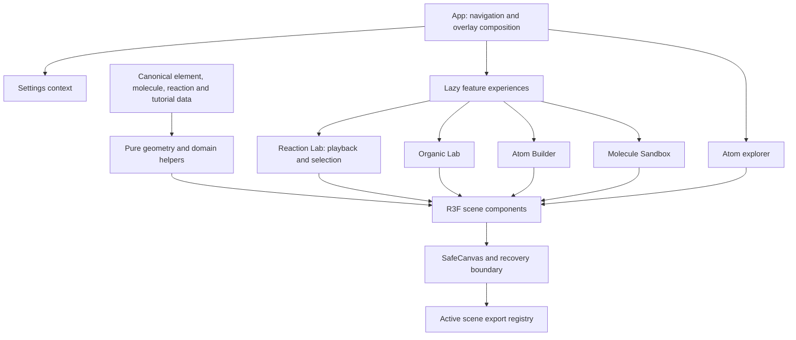

# Architecture

`App.jsx` owns navigation, selected element, overlay visibility and tutorial requests. `features/atom-explorer/AtomInfo.jsx` owns the atom information markup. `features/reaction-lab/ReactionLab.jsx` owns reaction selection, filtering and animation progress; an unmount snapshot saved in App retains the paused selection/progress across navigation without rerendering the application on every animation tick. Settings context owns complexity, orbital mode, playback speed and tutorial progress.

Existing cohesive feature components remain in `components/organic`, `components/tutorials`, `AtomBuilder.jsx` and `MoleculeSandbox.jsx`; moving every file was unnecessary. `engine` contains geometry, interpolation, validation and toy sandbox recognition independent of WebGL. `data` contains authored definitions; renderers consume those definitions rather than defining alternate molecule registries.

`SafeCanvas` registers the active scene for exports, handles context loss and caps device pixel ratio. `ExperienceBoundary` provides scene retry/reload without taking navigation down. R3F owns declaratively mounted geometry/material lifetimes. Effects clean up animation frames, event listeners and scene registrations.

Dialogs share focus trapping, Escape handling, background inertness and opener focus restoration. Canvas experiences expose textual context without claiming full screen-reader interaction with 3D objects.
