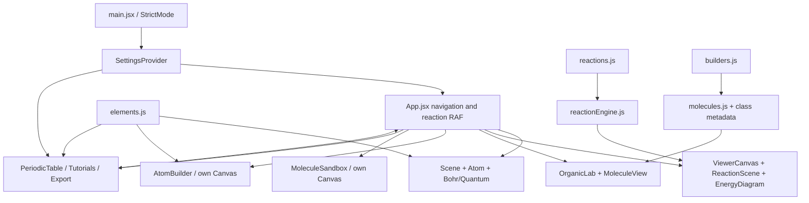

# Technical audit — baseline

Audited commit: `e3b125b18e0bf90060e3c40886b9ed6ed6cdec33` (2026-09-07).
This document records the pre-change baseline. Subsequent results belong in PERFORMANCE.md and CLEANUP_REPORT.md.

## Baseline

- Node 24.13.0 / npm 11.6.2; `npm ci` succeeds with a workspace-local cache (the default cache is not writable in this environment).
- `npm run build`: PASS, Vite 7.3.6, 2,647 modules, 4.45 seconds.
- JavaScript: one entry chunk, 1,674.49 kB / 488.67 kB gzip. CSS: 42.55 / 7.53 kB. Bundled font: 68.08 kB. Decimal kB as reported by Vite.
- `npm run lint`: FAIL, 39 errors and 3 warnings. Includes genuine undefined recognition, conditional tutorial hooks, unused code, and false unused JSX names because JSX usage is not registered.
- No tests or PR quality workflow.
- npm audit: 4 advisories (3 high, 1 moderate), affecting brace-expansion, js-yaml, nanoid and PostCSS. Compatible security updates should be targeted, not a general dependency upgrade.
- Browser baseline: Carbon Bohr scene renders with original lighting/trails; reaction controls and library mount. Full baseline regression testing is incomplete; do not infer all advertised features work from a successful build.

## Architecture and flow

State ownership: Settings owns complexity, orbital mode, speed and tutorial session. App owns navigation, selected element/reaction, playback, filtering and overlay visibility. Organic owns molecule/class/render controls. Builder owns particles. Sandbox owns atoms/bonds/discoveries, though recognition and saved-discovery functionality are missing. Every playback tick currently rerenders App and its navigation.

Rendering: React DOM overlays sit above independent R3F roots. Scene and ViewerCanvas share studio lighting but each has bloom/vignette; builder and sandbox use separate star fields. R3F owns declarative geometry/material disposal. Labels use a bundled font in active renderers. Domain geometry and reaction interpolation already use arrays and are React/Three-independent; orbital utilities import Three only for an unused spherical point generator.

Dependencies: React 19, Vite 7, Three, Fiber, Drei, postprocessing, Framer Motion, Tailwind/PostCSS. React Spring is imported only by the unreachable legacy ReactionRenderer. Remotion is a separate React 18 video project, not part of the production app.

## Risks and findings

1. Sandbox calls undefined `checkMolecule` on bond creation. No rendered discoveries or persistence despite README claims; drag ray allocations and competing camera controls are also present.
2. Export panel's 3D action downloads PNG. GLTF helpers are disconnected from scene access; PNG reads an arbitrary canvas without preserved framebuffer. Embed points to an unimplemented `/embed` route and hard-coded domain/element.
3. Tutorial hook after early returns violates hook order. Callback dependencies are missing; adding unstable callbacks naively would reset playback every render. Tutorial stage 3 references exceed the three-stage water definition. Camera/highlight/periodic-table fields are authored but not applied.
4. No error boundaries, WebGL recovery or scene initialization fallback.
5. Modals lack focus trapping, Escape and accessible close names. Periodic descriptions ignore complexity. Navigation branding is a clickable div. Fixed panels can overlap on tablets; table needs horizontal scrolling.
6. Chemistry: alkane terminal caps reverse the tripod's documented existing-bond direction (acute rather than tetrahedral angles). Several curated methyl caps use the same convention. Test geometry before correcting this.
7. Stability labels claim isotope certainty from a broad N/Z heuristic and classify tritium as stable. Builder's final Atom uses neutral element data regardless of charge; needs explicit context, not an unreviewed isotope database.
8. Quantum parser discards noble-gas cores; orbital occupancy pairs before filling degenerate orbitals. Lobes are stylized spheres, not probability calculations. Radius comment claims n² but implementation is linear. Preserve the illustration while documenting its limitations.
9. Reaction stages include representative fragments, hidden atoms and nuclear transmutations. Do not enforce full chemical atom conservation across nuclear scenes or claim kinetics. Energy profile is synthesized and normalized, with a tiny positive product level for zero ΔH.

## Size / performance

App 459 lines; elements 1,107; reactions 937; molecules 372; legacy ReactionRenderer 306; tutorial overlay 289; orbital renderer 275; sandbox 259. Large data tables are appropriate modules; App orchestration and feature UI should be separated.

Hotspots: up to 118 individual electron Trails; multiple per-atom meshes/labels and high tessellation; continuously rendered contact shadows; transparent orbital overdraw; reaction interpolation maps and SVG path rebuilt during every App playback tick; repeated sandbox vector allocations. Studio environment already renders once; don't degrade its appearance. Remove dead random orbit calculation, isolate playback, cache static diagram geometry, split heavy features before changing tessellation or bloom.

## Repository cleanup candidates

- Unreachable `ReactionRenderer.jsx`, `Molecule.jsx` and `components/bonds/` (confirm import graph before removal).
- Unused Atom legacy Electron and computed electron list.
- Vite starter `App.css`, `src/assets/react.svg`, favicon and `initial` marker.
- `remotion/out/Atomic Viz Demo.mp4` is generated video output; untrack it and ignore future output, keeping video sources and font license.
- `.agent`, `.claude`, `.cursor`, `.gemini`, `skills` are symlink adapters to one `.agents` Remotion skill, not duplicate implementations. Preserve useful tooling and document it.
- Tailwind v4 unused legacy config is a candidate; verify actual CSS pipeline first.

## Cleanup sequence

1. Commit this baseline before domain changes.
2. Add Vitest data/geometry/interpolation invariants, then regression cases for identified failures.
3. Extract cohesive atom/reaction views and callback-safe tutorial coordination; keep visual classes.
4. Isolate sandbox rules, canonical molecule IDs, structural validation and builder calculations. Correct only demonstrated defects with tests.
5. Lazy-load substantial experiences/exporter; measure chunks and inspect representative scenes.
6. Add scoped error recovery, working exports, keyboard/dialog handling and tablet safeguards.
7. Remove proven dead artifacts/dependencies; CI and truthful architecture/scientific documentation; final smoke matrix with explicit gaps.
